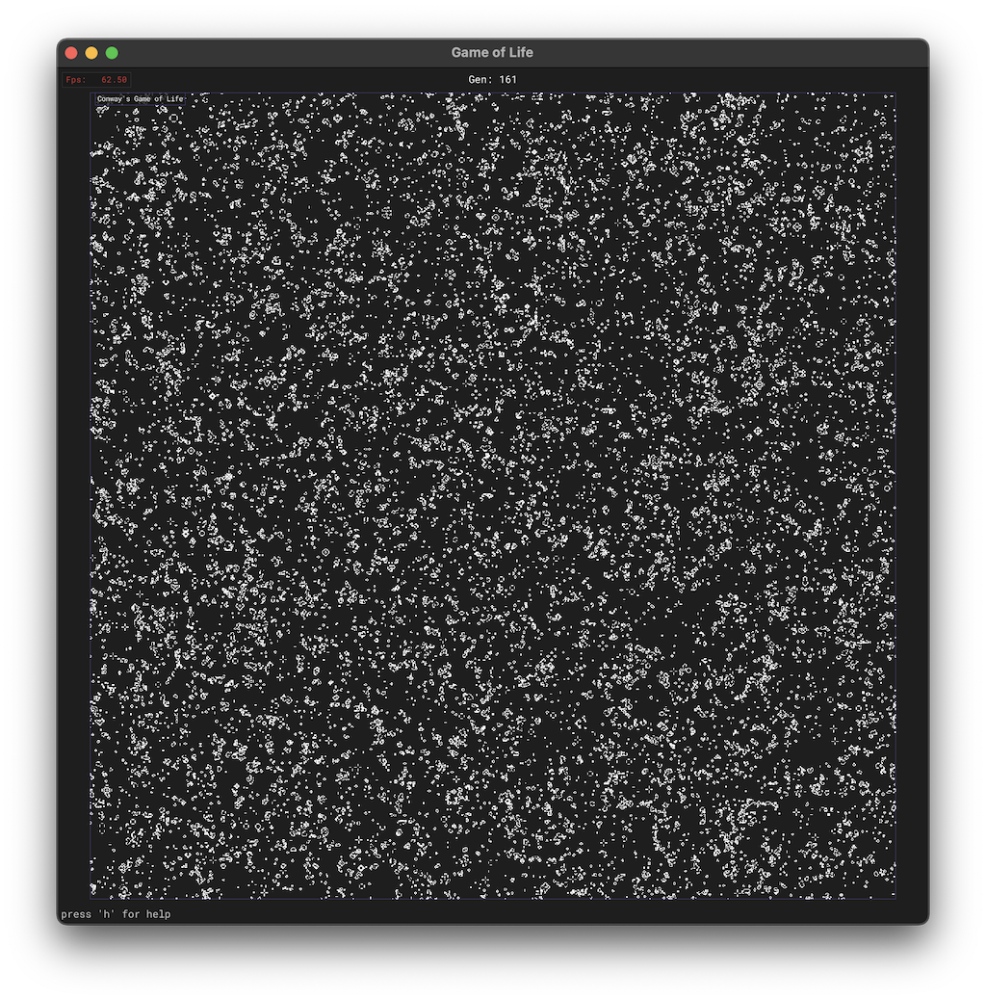
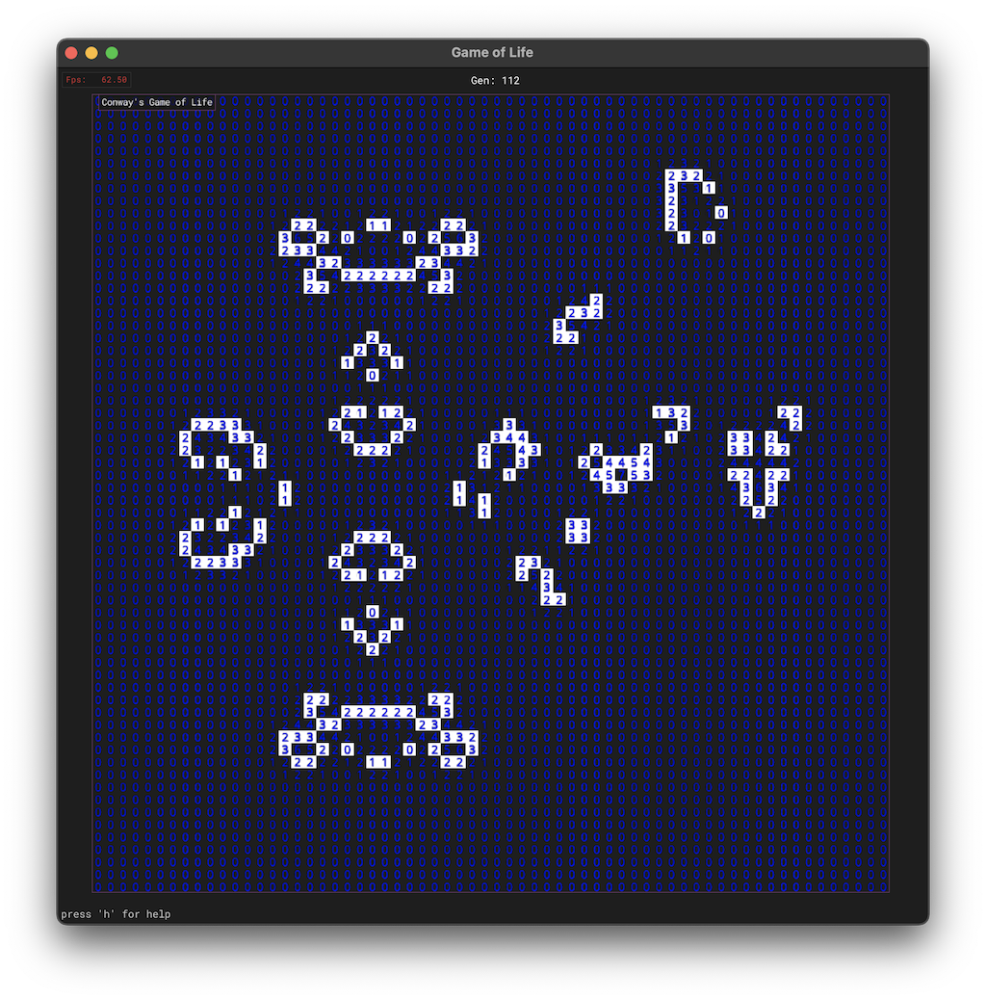

SDL3 Conway's Game of Life
======

A C++ implementation of [Conway's Game of Life](https://en.wikipedia.org/wiki/Conway%27s_Game_of_Life) using [SDL3](https://wiki.libsdl.org/SDL3/FrontPage).  

Supports starting from a random configuration, drawing cells manually, loading configurations from a file, or pasting a whole pattern (e.g. from [Life Lexicon](http://www.radicaleye.com/lifepage/lexicon.html)). 
Pasted patterns must follow the Life Lexicon format:
- Live cells are represented by ```O```
- Each row is on a new line
  
Cells can be inspected, highlighting live neighbouring cells. Each cell also displays its live neighbour count.  
Runs at >30 fps for game sizes of up to ~10'000'000 cells.

<p float="middle">
  
   
</p>

Installation
--------------------
- Clone the repository
- Install dependencies
- Build the project: ```make``` 
- Run the application: ```make run``` or  ```./build/gameOfLife <size>```

Controls
--------------------

|Button/Combination | Function                                        |
|-------------------|-------------------------------------------------|
| r                 | reset (random)                                  |
| c                 | clear                                           |
| d                 | enter/exit draw mode                            |
| left mouse button | inspect/draw                                    |
| scroll            | zoom in/out                                     |
| space             | pause/continue                                  |
| right arrow       | advance one step                                |
| ctrl + v          | paste pattern                                   |
| 0-9*              | load pattern from file                          |
| esc               | leave mode                                      |

Dependencies
--------------------
- SDL3
- SDL3_ttf
